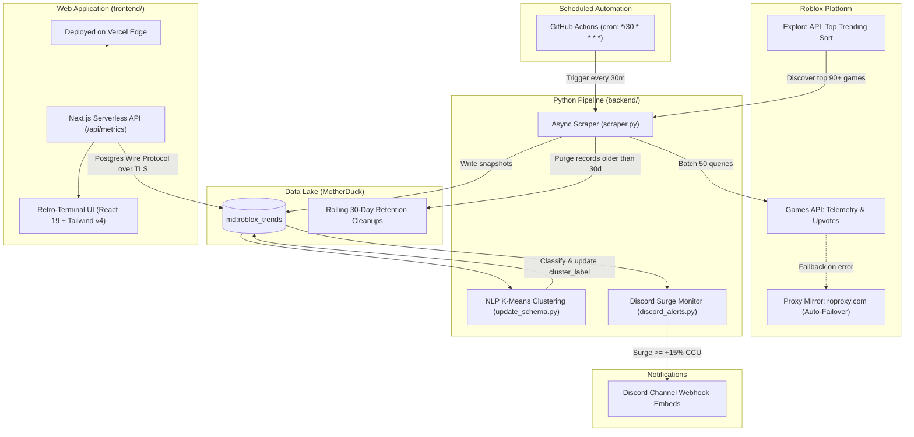
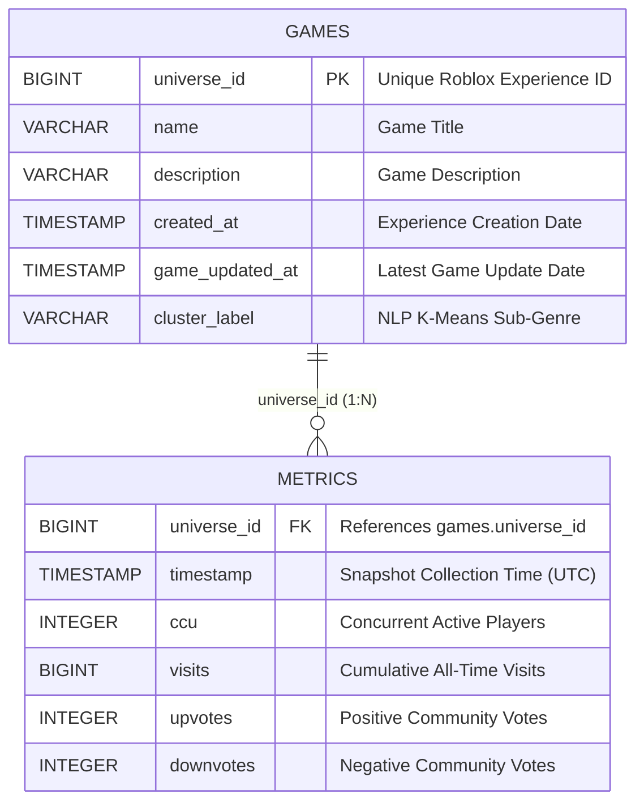

# 🕹️ Roblox Real-Time Trend Tracker & Analytical Pipeline (BloxTrends)

[](https://nextjs.org/)
[](https://react.dev/)
[](https://motherduck.com/)
[](https://python.org/)
[](https://scikit-learn.org/)
[](https://tailwindcss.com/)
[](https://vercel.com/)
[](https://github.com/features/actions)

An end-to-end, full-stack analytical platform that tracks, clusters, and visualizes trending experiences on Roblox in real time. 

Powered by **MotherDuck** (cloud-native DuckDB engine), the system couples an asynchronous Python scraping and NLP clustering pipeline with automated **GitHub Actions** scheduling, instant **Discord webhook alerts** for surging games, and a modern retro-terminal **Next.js 16** web dashboard deployed on **Vercel**.

---

## 📑 Table of Contents

- [System Architecture](#-system-architecture)
- [Monorepo Structure](#-monorepo-structure)
- [Core Features](#-core-features)
  - [1. Cloud-Native DuckDB Pipeline](#1-cloud-native-duckdb-pipeline)
  - [2. Machine Learning Sub-Genre Discovery](#2-machine-learning-sub-genre-discovery)
  - [3. Discord Player Surge Alerts](#3-discord-player-surge-alerts)
  - [4. Next.js 16 Terminal Web Dashboard](#4-nextjs-16-terminal-web-dashboard)
- [Quickstart Guide](#-quickstart-guide)
  - [Prerequisites](#prerequisites)
  - [Environment Variables](#environment-variables)
  - [Backend Setup & Execution](#backend-setup--execution)
  - [Frontend Setup & Dev Server](#frontend-setup--dev-server)
- [Automated Scheduled Ingestion](#-automated-scheduled-ingestion)
- [Production Deployment](#-production-deployment)
- [Database Schema](#-database-schema)

---

## 🏛 System Architecture



---

## 📂 Monorepo Structure

```text
rob-trend-tracker/
├── .github/
│   └── workflows/
│       └── scrape.yml             # 30-minute automated GitHub Actions ingestion cron
├── backend/                       # Python analytics & machine learning engine
│   ├── discord_alerts.py          # Discord surge webhook notifier
│   ├── genre_clustering.py        # TF-IDF + K-Means clustering script
│   ├── init_db.py                 # MotherDuck table initialization & schema validation
│   ├── scraper.py                 # Async Roblox API scraper & 30-day retention engine
│   ├── update_schema.py           # Automated cluster label migration runner
│   ├── dashboard.py               # Local Streamlit + Plotly visual dashboard
│   ├── requirements.txt           # Python dependency manifest
│   └── README.md                  # Dedicated backend documentation
├── frontend/                      # Next.js 16 production web application
│   ├── app/
│   │   ├── api/
│   │   │   └── metrics/route.ts   # Serverless MotherDuck Postgres gateway endpoint
│   │   ├── globals.css            # Retro-terminal typography, CRT scanlines & themes
│   │   ├── layout.tsx             # Root layout shell
│   │   └── page.tsx               # Main interactive dashboard & modal components
│   ├── package.json               # Node.js dependencies (pg, Next.js, React, Tailwind)
│   ├── next.config.ts             # Next.js configuration
│   └── README.md                  # Dedicated frontend documentation
├── .env                           # Environment configuration (ignored in git)
├── .gitignore                     # Git ignore rules
└── README.md                      # Project root documentation (this file)
```

---

## ⚡ Core Features

### 1. Cloud-Native DuckDB Pipeline
- Leverages **MotherDuck** as a unified cloud data lake. Both the Python scraper and the Next.js serverless functions query the exact same live analytical database (`md:roblox_trends`).
- Implements a rolling **30-day retention policy** automatically executing `DELETE FROM metrics WHERE timestamp < CURRENT_TIMESTAMP - INTERVAL 30 DAY` at the end of each scraper pass.

### 2. Machine Learning Sub-Genre Discovery
- Roblox standard genres ("Simulation", "Action") are often generic.
- The pipeline uses **TF-IDF n-gram vectorization** (`(1, 2)` n-grams) on concatenated titles and developer descriptions, combined with **K-Means clustering** and **Silhouette score optimization** ($k \in [3, 7]$) to generate descriptive sub-genres (e.g., `Steal / Eggs / Treadmill`, `Horror / Escape / Survival`, `Aim / Skins / Battle`).

### 3. Discord Player Surge Alerts
- `backend/discord_alerts.py` evaluates recent snapshots to identify breakout experiences:
  - CCU jump $\ge 15.0\%$ between consecutive snapshots, OR
  - Raw player surge $\ge +5,000$ CCU.
- Generates rich Discord embeds with live player counts, velocity deltas, cumulative visits, and direct launch links.

### 4. Next.js 16 Terminal Web Dashboard
- **Real-Time Leaderboard**: Live player counts, peak CCUs, total visits, and community approval ratings.
- **Trend Velocity & "Rising Stars" Mode**: Tracks real-time player momentum ($\pm\%$ CCU changes).
- **Genre Market Share**: Distribution bar visualizing player distribution across sub-genres.
- **Inline SVG Sparklines**: Historical 10-point player curves inside each row.
- **Deep Inspector Modal**: Detailed drill-down with scaled trajectory charts, vote ratios, and game launch actions.
- **Retro-Modern Aesthetic**: Playful terminal motif with pixel badges, scanlines, and instant Light/Dark mode toggling.
- **MotherDuck Postgres Wire Gateway**: Pure-Node `pg` connection without native shared libraries (`libduckdb.so`), ensuring 100% serverless stability on Vercel.

---

## 🚀 Quickstart Guide

### Prerequisites
- **Python**: `3.10+` (3.11 recommended)
- **Node.js**: `18.17+` (v20 or v22 LTS recommended)
- **MotherDuck Account**: Free token from [motherduck.com](https://motherduck.com)

---

### Environment Variables

Create a `.env` file in the root directory:

```ini
# MotherDuck Access Token
MOTHERDUCK_TOKEN=eyJhbGciOi...

# Optional: Discord Webhook URL for player surge notifications
DISCORD_WEBHOOK_URL=https://discord.com/api/webhooks/...

# Optional: Host override (defaults to pg.ap-northeast-1-aws.motherduck.com)
MOTHERDUCK_HOST=pg.ap-northeast-1-aws.motherduck.com
```

---

### Backend Setup & Execution

1. **Install Python dependencies**:
   ```bash
   cd backend
   pip install -r requirements.txt
   ```

2. **Initialize Database Tables**:
   ```bash
   python init_db.py
   ```

3. **Run Ingestion Scraper**:
   ```bash
   python scraper.py
   ```

4. **Run Clustering & Sub-Genre Sync**:
   ```bash
   python update_schema.py
   ```

5. **(Optional) Check Discord Alerts**:
   ```bash
   python discord_alerts.py
   ```

6. **(Optional) Run Local Streamlit Dashboard**:
   ```bash
   streamlit run dashboard.py
   ```

---

### Frontend Setup & Dev Server

1. **Install Node dependencies**:
   ```bash
   cd frontend
   npm install
   ```

2. **Start Next.js Development Server**:
   ```bash
   npm run dev
   ```

3. **Open in Browser**:
   Navigate to [http://localhost:3000](http://localhost:3000).

4. **Verify Production Build**:
   ```bash
   npm run build
   ```

---

## ⏰ Automated Scheduled Ingestion

The repository includes a GitHub Actions workflow in [`.github/workflows/scrape.yml`](file:///C:/Users/Israel/OneDrive/%E6%96%87%E6%A1%A3/BSCS%204%20Files/dev/rob-trend-tracker/.github/workflows/scrape.yml):

- Runs on a cron schedule every 30 minutes (`*/30 * * * *`).
- Executes `python scraper.py` followed by `python update_schema.py`.
- Keeps the MotherDuck database updated 24/7 without requiring a dedicated local runner.
- **Setup**: Add `MOTHERDUCK_TOKEN` to your GitHub repository secrets under `Settings > Secrets and variables > Actions`.

---

## 🌐 Production Deployment

### Frontend on Vercel
1. Import the repository into your [Vercel](https://vercel.com) dashboard.
2. Set the **Root Directory** to `frontend`.
3. Add `MOTHERDUCK_TOKEN` in **Project Settings > Environment Variables**.
4. Deploy — Vercel builds the Next.js app and deploys the `/api/metrics` serverless function.

---

## 🗄 Database Schema



---

## 📄 Further Reading
- [Backend Documentation (`backend/README.md`)](file:///C:/Users/Israel/OneDrive/%E6%96%87%E6%A1%A3/BSCS%204%20Files/dev/rob-trend-tracker/backend/README.md)
- [Frontend Documentation (`frontend/README.md`)](file:///C:/Users/Israel/OneDrive/%E6%96%87%E6%A1%A3/BSCS%204%20Files/dev/rob-trend-tracker/frontend/README.md)
