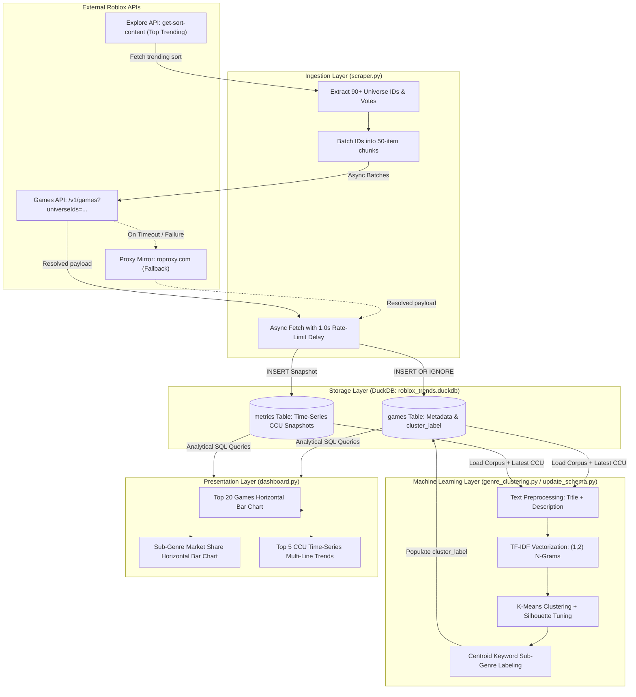
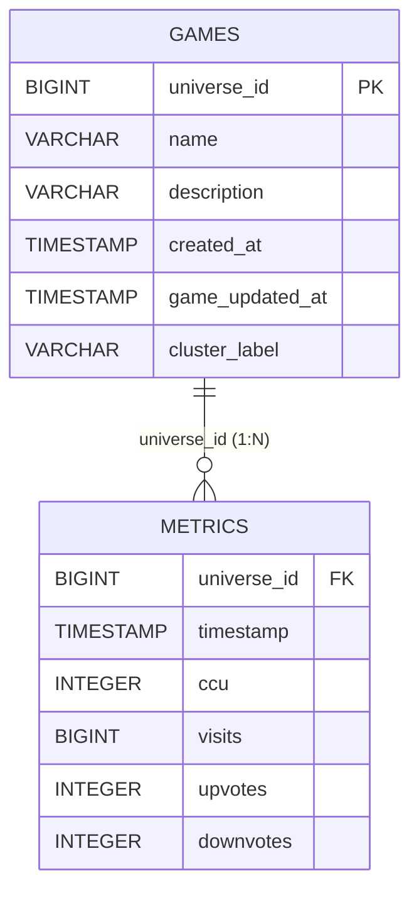

# 🎮 Roblox Real-Time Trend Tracker & Analytical ML Pipeline

A high-performance, local time-series analytics and machine learning pipeline for tracking, clustering, and visualizing trending Roblox games. 

Instead of relying on heavy cloud databases, this project utilizes **DuckDB** as an embedded analytical data engine paired with **`aiohttp`** for asynchronous ingestion, **`scikit-learn`** for NLP-driven sub-genre clustering, and **`Streamlit` + `Plotly`** for interactive real-time dashboards.

---

## 📑 Table of Contents

- [Architecture & Workflow](#-architecture--workflow)
- [Project Files & Component Roles](#-project-files--component-roles)
- [Database Schema & Data Model](#-database-schema--data-model)
- [How the Tracker Works](#-how-the-tracker-works)
  - [1. Data Ingestion & Network Resilience](#1-data-ingestion--network-resilience)
  - [2. Time-Series Storage Strategy](#2-time-series-storage-strategy)
  - [3. NLP Text Preprocessing & Sub-Genre Clustering](#3-nlp-text-preprocessing--sub-genre-clustering)
  - [4. Interactive Visual Dashboard](#4-interactive-visual-dashboard)
- [Quickstart & Execution Guide](#-quickstart--execution-guide)
- [Configuration & Tuning](#-configuration--tuning)

---

## 🏛 Architecture & Workflow

The pipeline moves data through four distinct stages: **Ingestion**, **Storage**, **NLP Clustering**, and **Visualization**.



---

## 📂 Project Files & Component Roles

| File | Purpose | Key Technologies |
| :--- | :--- | :--- |
| **`init_db.py`** | Initializes the local DuckDB database file (`roblox_trends.duckdb`), defines relational tables (`games` and `metrics`), sets primary/foreign key constraints, and validates schema integrity. | `duckdb`, `pathlib` |
| **`scraper.py`** | High-throughput asynchronous ingestion pipeline. Pulls top trending universe IDs from the Explore API, chunks queries into batches of 50, polls game statistics, handles rate limiting, and writes time-series records. | `aiohttp`, `asyncio`, `duckdb` |
| **`update_schema.py`** | Database schema migration script. Adds the `cluster_label` column to the `games` table and executes K-Means clustering to classify and label all stored games. | `duckdb`, `scikit-learn`, `pandas` |
| **`genre_clustering.py`** | Standalone machine learning and NLP exploration script. Preprocesses titles/descriptions, extracts TF-IDF n-grams, computes silhouette scores across candidate $k$ values, and generates a formatted market-share terminal report. | `scikit-learn`, `numpy`, `pandas`, `duckdb` |
| **`dashboard.py`** | Interactive analytical web dashboard rendering real-time KPI metrics, top-game rankings, genre player shares, and multi-line time-series trend charts. | `streamlit`, `plotly.express`, `duckdb` |
| **`requirements.txt`** | Dependency manifest specifying core analytical, machine learning, and visualization libraries. | `pip` |
| **`roblox_trends.duckdb`** | Single-file, zero-dependency embedded columnar database storing dimensional game metadata and high-frequency metric snapshots. | Embedded DuckDB engine |

---

## 🗄 Database Schema & Data Model

The pipeline utilizes a relational time-series star-like schema optimized for DuckDB's vectorized columnar engine:



### Table Definitions

#### 1. `games` Table (Dimensional Entity)
- **`universe_id`** (`BIGINT PRIMARY KEY`): Unique game experience identifier across the platform.
- **`name`** (`VARCHAR`): Game title.
- **`description`** (`VARCHAR`): Full developer game description.
- **`created_at`** (`TIMESTAMP`): Original date/time the game experience was published.
- **`game_updated_at`** (`TIMESTAMP`): Timestamp of the game's latest published update.
- **`cluster_label`** (`VARCHAR`): Sub-genre classification derived via NLP K-Means clustering.

#### 2. `metrics` Table (Time-Series Fact Entity)
- **`universe_id`** (`BIGINT`): Foreign key referencing `games(universe_id)`.
- **`timestamp`** (`TIMESTAMP`): UTC timestamp when this data point was collected.
- **`ccu`** (`INTEGER`): Concurrent players actively in-game (`playing` count).
- **`visits`** (`BIGINT`): Cumulative all-time game visit count.
- **`upvotes`** (`INTEGER`): Positive player upvotes.
- **`downvotes`** (`INTEGER`): Negative player downvotes.

> [!NOTE]
> Separating immutable/slow-changing game metadata from high-frequency metric snapshots prevents text duplication, conserving disk space and speeding up analytical aggregations.

---

## ⚙️ How the Tracker Works

### 1. Data Ingestion & Network Resilience

1. **Discovery (Explore API)**:
   The scraper targets the Roblox Explore sort endpoint:
   ```text
   https://apis.roblox.com/explore-api/v1/get-sort-content?sortId=top-trending&sessionId=ml_pipeline_worker&device=computer
   ```
   This returns ~90-100 top trending games on the platform along with initial vote and player counts.

2. **Automatic Failover & Mirror Routing**:
   Certain ISP and regional network routes face routing blocks or Cloudflare connection timeouts when contacting Roblox edge IPs directly. The `RobloxClient` class implements smart fallback detection:
   - Primary: `https://apis.roblox.com` and `https://games.roblox.com`
   - Fallback Mirror: `https://apis.roproxy.com` and `https://games.roproxy.com`
   If the direct endpoint times out or fails, the client seamlessly switches to the proxy mirror for all subsequent requests without stalling the pipeline.

3. **Batching & Rate Limiting**:
   Roblox limits the `universeIds` query parameter on the Games API to batches of 50:
   ```text
   https://games.roblox.com/v1/games?universeIds=ID1,ID2,...,ID50
   ```
   The scraper splits IDs into chunks of 50 and pauses `1.0` second (`await asyncio.sleep(1.0)`) between batch queries to respect Cloudflare rate limits.

---

### 2. Time-Series Storage Strategy

When writing data to DuckDB:
- **`games` table**: Uses `INSERT OR IGNORE INTO games ...` to insert newly discovered games while leaving existing titles untouched.
- **`metrics` table**: Appends an immutable snapshot record with the exact collection timestamp `datetime.now(timezone.utc)`. Every scraper execution adds a new point in time, enabling time-series velocity tracking, trend analysis, and CCU momentum calculations.

In analytical queries, the latest CCU is extracted using DuckDB's vectorized window functions:
```sql
WITH latest_metrics AS (
    SELECT 
        universe_id,
        ccu,
        ROW_NUMBER() OVER (PARTITION BY universe_id ORDER BY timestamp DESC) AS rn
    FROM metrics
)
SELECT g.name, m.ccu 
FROM latest_metrics m
JOIN games g ON m.universe_id = g.universe_id
WHERE m.rn = 1
ORDER BY m.ccu DESC;
```

---

### 3. NLP Text Preprocessing & Sub-Genre Clustering

Roblox experience genres are frequently broad (e.g. "Simulation" or "Action"). To identify emergent trends (e.g., *Brainrot simulators*, *treadmill steal games*, *anime duels*, or *zombie survival*), `genre_clustering.py` and `update_schema.py` employ machine learning:

1. **Text Cleansing**:
   - Concatenates game title and developer description.
   - Converts text to lowercase.
   - Uses regex (`[^a-zA-Z\s]`) to strip punctuation, symbols, and Unicode game title emojis.
   - Eliminates standard English stop words (`scikit-learn` `ENGLISH_STOP_WORDS`).

2. **TF-IDF Feature Extraction**:
   - Uses `TfidfVectorizer(max_features=100, ngram_range=(1, 2))` to extract top unigrams and bigrams (e.g., `"steal"`, `"eggs"`, `"treadmill"`, `"join group"`, `"sniper arena"`).

3. **K-Means Clustering & Silhouette Optimization**:
   - Iterates through candidate cluster counts $k \in [3, 7]$ calculating the **Silhouette Score** to mathematically determine the best cluster separation.
   - Fits the final `KMeans` model and extracts the top 3-5 centroid keywords to generate human-readable sub-genre labels (e.g., `Steal / Eggs / Treadmill`, `Game / Skins / Aim`, `Animals / Eggs / Cash`).

4. **Market Share Attribution**:
   - Aggregates latest CCU per cluster to quantify player market share across sub-genres.

---

### 4. Interactive Visual Dashboard

The Streamlit dashboard (`dashboard.py`) runs analytical queries directly on DuckDB and renders three interactive Plotly visualizations:

1. **Top 20 Games by CCU**: Horizontal bar chart showing currently dominating games with hover cards displaying cumulative visits and votes.
2. **Genre Market Share**: Horizontal bar chart illustrating total active player distribution across machine-learning-derived sub-genres.
3. **CCU Time-Series Trends**: Multi-line chart showing historical CCU momentum across consecutive ingestion snapshots for the top 5 games.
4. **KPI Cards & Drill-Down Tables**: Summary numbers for active players, top titles, and expandable raw metric inspection tables.

---

## 🚀 Quickstart & Execution Guide

### 1. Environment Setup

Ensure Python 3.10+ is installed, then install all project dependencies:

```powershell
pip install -r requirements.txt
```

---

### 2. Initialize Database

Run `init_db.py` to create the database file and establish the schema:

```powershell
python init_db.py
```

*Expected output: Verifies creation of `games` and `metrics` tables with primary and foreign key constraints.*

---

### 3. Ingest Live Trending Data

Run `scraper.py` to fetch trending Roblox experiences and insert snapshot records:

```powershell
python scraper.py
```

> [!TIP]
> Run `python scraper.py` multiple times across minutes or hours (or schedule it with a recurring cron/task) to collect historical data points for the time-series charts.

---

### 4. Run Sub-Genre Clustering & Update Labels

Run `update_schema.py` to classify games into sub-genres and populate the `cluster_label` column:

```powershell
python update_schema.py
```

To run a standalone terminal analysis with silhouette score evaluations:

```powershell
python genre_clustering.py
```

---

### 5. Launch the Web Dashboard

Start the Streamlit analytics interface:

```powershell
streamlit run dashboard.py
```

The dashboard will open automatically in your browser at:
`http://localhost:8501`

---

## 🛠 Configuration & Tuning

Key configuration parameters can be customized directly in the scripts:

| File | Variable | Default | Description |
| :--- | :--- | :--- | :--- |
| `scraper.py` | `BATCH_SIZE` | `50` | Maximum universe IDs per Games API request (Roblox platform cap). |
| `scraper.py` | `BATCH_DELAY_SECONDS` | `1.0` | Asynchronous wait time between batches to prevent Cloudflare 429 errors. |
| `scraper.py` | `REQUEST_TIMEOUT` | `8.0`s | HTTP request timeout before failing over to the proxy mirror. |
| `genre_clustering.py` | `max_features` | `100` | Maximum vocabulary size for TF-IDF feature matrix. |
| `genre_clustering.py` | `ngram_range` | `(1, 2)` | Unigram and bigram extraction window for game descriptions. |
| `genre_clustering.py` | `--k` | `None` (auto) | Set a fixed cluster count (e.g. `--k 5`) or leave unset for automatic silhouette optimization. |
