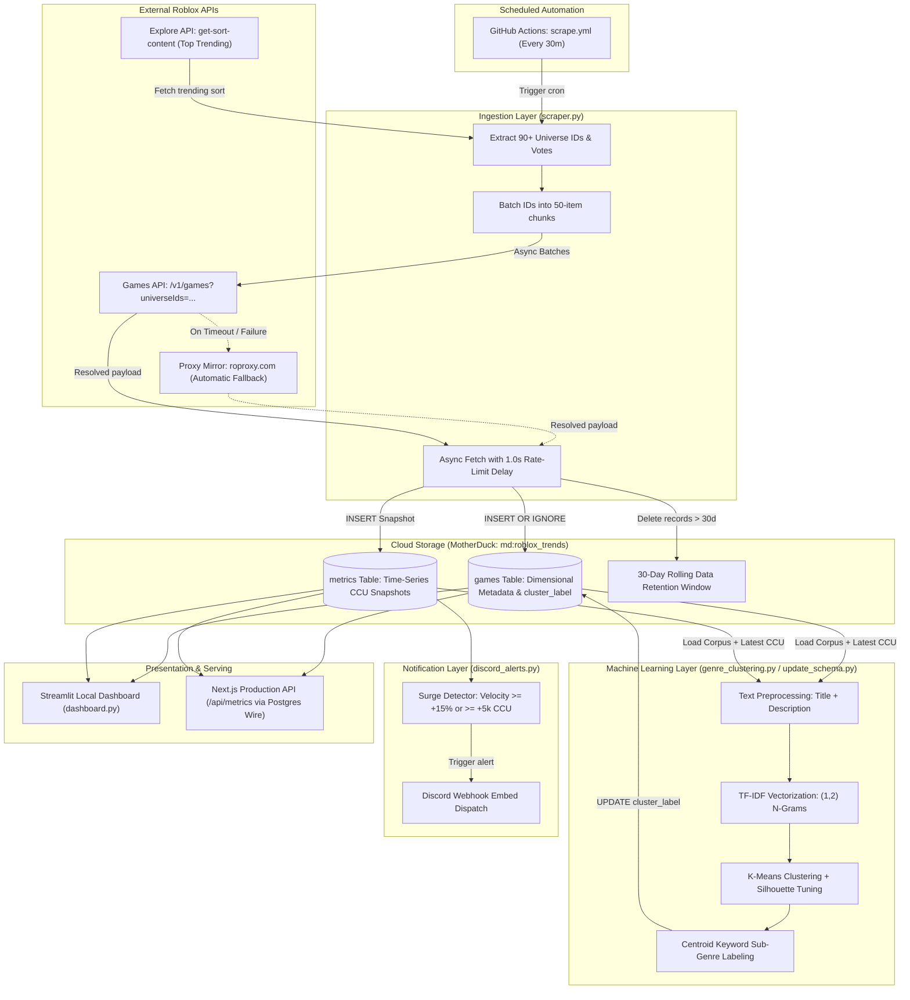
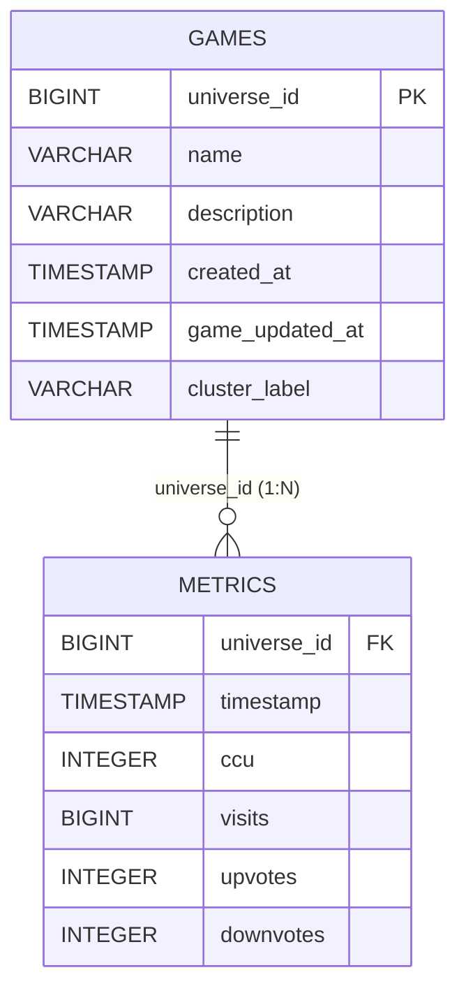

# 🎮 Roblox Real-Time Trend Tracker & Analytical ML Pipeline (Backend)

A high-performance, asynchronous time-series analytics and machine learning pipeline for tracking, clustering, and visualizing trending Roblox experiences in the cloud.

The backend leverages **MotherDuck** (serverless cloud DuckDB) for analytical storage, **`aiohttp`** for non-blocking asynchronous ingestion with automatic proxy failover, **`scikit-learn`** for NLP-driven sub-genre clustering, **GitHub Actions** for automated 30-minute scheduled polling, and **Discord Webhooks** for instant player surge alerts.

---

## 📑 Table of Contents

- [Architecture & Workflow](#-architecture--workflow)
- [Project Files & Component Roles](#-project-files--component-roles)
- [Database Schema & Data Model](#-database-schema--data-model)
- [How the Backend Works](#-how-the-backend-works)
  - [1. Data Ingestion & Network Resilience](#1-data-ingestion--network-resilience)
  - [2. MotherDuck Cloud Storage & Retention](#2-motherduck-cloud-storage--retention)
  - [3. NLP Text Preprocessing & Sub-Genre Clustering](#3-nlp-text-preprocessing--sub-genre-clustering)
  - [4. Discord Surge Webhook Alerts](#4-discord-surge-webhook-alerts)
  - [5. Streamlit Local Dashboard](#5-streamlit-local-dashboard)
- [Quickstart & Execution Guide](#-quickstart--execution-guide)
- [Automated GitHub Actions Cron](#-automated-github-actions-cron)
- [Configuration & Tuning](#-configuration--tuning)

---

## 🏛 Architecture & Workflow

The backend pipeline processes telemetry through five core stages: **Ingestion**, **MotherDuck Cloud Storage**, **NLP Clustering**, **Surge Detection & Alerts**, and **Analytics Serving**.



---

## 📂 Project Files & Component Roles

| File | Purpose | Key Technologies |
| :--- | :--- | :--- |
| **`scraper.py`** | High-throughput asynchronous ingestion pipeline. Pulls top trending universe IDs from the Explore API, chunks queries into batches of 50, polls game statistics, handles rate limiting, writes snapshots to MotherDuck, and enforces 30-day retention. | `aiohttp`, `asyncio`, `duckdb`, `python-dotenv` |
| **`init_db.py`** | Initializes the MotherDuck database (`md:roblox_trends`), creates the `games` and `metrics` relational tables, sets primary/foreign key constraints, and validates schema integrity. | `duckdb`, `python-dotenv` |
| **`update_schema.py`** | Automated clustering migration. Extracts text features from all stored experiences, trains K-Means models, and updates `games.cluster_label` directly in MotherDuck. | `duckdb`, `scikit-learn`, `pandas` |
| **`genre_clustering.py`** | Machine learning exploration script. Preprocesses titles/descriptions, extracts TF-IDF n-grams, computes silhouette scores across candidate $k \in [3, 7]$, and prints a formatted market-share terminal report. | `scikit-learn`, `numpy`, `pandas`, `duckdb` |
| **`discord_alerts.py`** | Real-time momentum monitoring script. Detects experiences surging $\ge 15\%$ CCU or gaining $\ge 5,000$ active players, formatting rich Discord embeds with play links and stats. | `urllib.request`, `duckdb`, `python-dotenv` |
| **`dashboard.py`** | Interactive analytical web dashboard for local exploration, rendering KPI cards, top-game rankings, genre player shares, and multi-line time-series trend charts. | `streamlit`, `plotly.express`, `duckdb` |
| **`requirements.txt`** | Dependency manifest specifying core analytical, machine learning, and visualization libraries. | `pip` |

---

## 🗄 Database Schema & Data Model

The pipeline utilizes a star-like time-series relational schema optimized for DuckDB's vectorized columnar engine:



### Table Definitions

#### 1. `games` Table (Dimensional Entity)
- **`universe_id`** (`BIGINT PRIMARY KEY`): Unique game experience identifier.
- **`name`** (`VARCHAR`): Game title.
- **`description`** (`VARCHAR`): Full developer game description.
- **`created_at`** (`TIMESTAMP`): Original date/time the game experience was published.
- **`game_updated_at`** (`TIMESTAMP`): Timestamp of the game's latest published update.
- **`cluster_label`** (`VARCHAR`): Sub-genre classification derived via NLP K-Means clustering.

#### 2. `metrics` Table (Time-Series Fact Entity)
- **`universe_id`** (`BIGINT`): Foreign key referencing `games(universe_id)`.
- **`timestamp`** (`TIMESTAMP`): UTC timestamp when this data point was collected.
- **`ccu`** (`INTEGER`): Concurrent active players (`playing` count).
- **`visits`** (`BIGINT`): Cumulative all-time game visit count.
- **`upvotes`** (`INTEGER`): Positive player upvotes.
- **`downvotes`** (`INTEGER`): Negative player downvotes.

> [!NOTE]
> Separating immutable/slow-changing game metadata from high-frequency metric snapshots prevents text duplication, conserving bandwidth and accelerating analytical queries.

---

## ⚙️ How the Backend Works

### 1. Data Ingestion & Network Resilience

1. **Discovery (Explore API)**:
   The scraper targets the Roblox Explore sort endpoint:
   ```text
   https://apis.roblox.com/explore-api/v1/get-sort-content?sortId=top-trending&sessionId=ml_pipeline_worker&device=computer
   ```
   This returns ~90-100 top trending games on the platform with vote and player counts.

2. **Automatic Failover & Mirror Routing**:
   Certain ISP and regional network routes face routing blocks or Cloudflare connection timeouts when contacting Roblox edge IPs directly. The `RobloxClient` class implements smart fallback detection:
   - Primary: `https://apis.roblox.com` and `https://games.roblox.com`
   - Fallback Mirror: `https://apis.roproxy.com` and `https://games.roproxy.com`
   If the direct endpoint times out or fails, the client seamlessly switches to the proxy mirror for all subsequent requests without stalling the pipeline.

3. **Batching & Rate Limiting**:
   Roblox limits the `universeIds` query parameter on the Games API to batches of 50. The scraper splits IDs into chunks of 50 and pauses `1.0` second (`await asyncio.sleep(1.0)`) between batch queries to respect Cloudflare rate limits.

---

### 2. MotherDuck Cloud Storage & Retention

All backend processes persist directly to **MotherDuck** via the connection string:
```python
duckdb.connect(f"md:roblox_trends?motherduck_token={os.environ.get('MOTHERDUCK_TOKEN')}")
```

- **`games` table**: Uses `INSERT OR IGNORE INTO games ...` to insert newly discovered games while preserving existing dimensional data.
- **`metrics` table**: Appends an immutable snapshot record with UTC timestamp `datetime.now(timezone.utc)`.
- **30-Day Rolling Retention Window**: At the end of every ingestion pass, the scraper executes:
  ```sql
  DELETE FROM metrics
  WHERE timestamp < CURRENT_TIMESTAMP - INTERVAL 30 DAY;
  ```
  This automatically purges stale records, maintaining consistent query latency and predictable storage footprints.

---

### 3. NLP Text Preprocessing & Sub-Genre Clustering

Roblox experience genres are frequently broad (e.g. "Simulation" or "Action"). To identify emergent trends (e.g., *Brainrot simulators*, *treadmill steal games*, *anime duels*, or *mascot horror*), `genre_clustering.py` and `update_schema.py` employ machine learning:

1. **Text Cleansing**: Concatenates game title and developer description, lowercases text, removes punctuation and emoji artifacts using regex (`[^a-zA-Z\s]`), and removes English stop words.
2. **TF-IDF Feature Extraction**: Uses `TfidfVectorizer(max_features=100, ngram_range=(1, 2))` to extract top unigrams and bigrams.
3. **K-Means Clustering & Silhouette Optimization**: Iterates through candidate cluster counts $k \in [3, 7]$ calculating the **Silhouette Score** to mathematically determine the optimal cluster count.
4. **Centroid Keyword Labeling**: Extracts the top 3-5 centroid keywords to generate human-readable sub-genre labels (e.g., `Steal / Eggs / Treadmill`, `Game / Skins / Aim`, `Horror / Escape / Survival`).
5. **Database Sync**: `update_schema.py` updates `games.cluster_label` in MotherDuck so both the Next.js frontend and Streamlit dashboard reflect the latest clustering model.

---

### 4. Discord Surge Webhook Alerts

`backend/discord_alerts.py` can be triggered manually or chained after scraping to monitor sudden player spikes:

- **Trigger Criteria**:
  - CCU percentage velocity change $\ge 15.0\%$ compared to previous snapshot, OR
  - Absolute CCU surge $\ge +5,000$ active players.
- **Output**: Formats rich Discord embeds containing current CCU, delta, genre badge, total visits, and a direct Roblox discover link.
- **Dry-Run Mode**: If `DISCORD_WEBHOOK_URL` is omitted, detected surges are printed directly to the terminal without failing.

---

### 5. Streamlit Local Dashboard

`dashboard.py` runs analytical queries directly on DuckDB and renders three interactive Plotly visualizations:
1. **Top 20 Games by CCU**: Horizontal bar chart showing currently dominating games with hover cards displaying cumulative visits and votes.
2. **Genre Market Share**: Horizontal bar chart illustrating total active player distribution across sub-genres.
3. **CCU Time-Series Trends**: Multi-line chart showing historical CCU momentum across consecutive ingestion snapshots for the top 5 games.

---

## 🚀 Quickstart & Execution Guide

### 1. Environment Setup

Ensure Python 3.10+ is installed, then install all dependencies:

```powershell
cd backend
pip install -r requirements.txt
```

Create a `.env` file in the root of the project (or inside `backend/`):

```ini
MOTHERDUCK_TOKEN=eyJhbGciOi...
DISCORD_WEBHOOK_URL=https://discord.com/api/webhooks/...  # Optional
```

---

### 2. Initialize Database

Run `init_db.py` to create tables and verify the schema in MotherDuck:

```powershell
python init_db.py
```

---

### 3. Ingest Live Trending Data

Run `scraper.py` to fetch trending Roblox experiences and insert snapshot records:

```powershell
python scraper.py
```

---

### 4. Run Sub-Genre Clustering & Update Labels

Run `update_schema.py` to classify games into sub-genres and populate `cluster_label`:

```powershell
python update_schema.py
```

To run a standalone terminal analysis with silhouette score evaluations:

```powershell
python genre_clustering.py
```

---

### 5. Check for Surging Games & Send Discord Alerts

```powershell
python discord_alerts.py
```

---

### 6. Launch the Local Streamlit Dashboard

```powershell
streamlit run dashboard.py
```

The dashboard will open automatically in your browser at `http://localhost:8501`.

---

## ⏰ Automated GitHub Actions Cron

The backend repository includes an automated workflow at [`.github/workflows/scrape.yml`](file:///C:/Users/Israel/OneDrive/%E6%96%87%E6%A1%A3/BSCS%204%20Files/dev/rob-trend-tracker/.github/workflows/scrape.yml):

- **Schedule**: Executes automatically every 30 minutes via GitHub Actions cron (`*/30 * * * *`).
- **Pipeline**: Runs `python scraper.py` followed by `python update_schema.py`.
- **Environment**: Reads `MOTHERDUCK_TOKEN` from GitHub Repository Secrets (`Settings > Secrets and variables > Actions`).

---

## 🛠 Configuration & Tuning

| File | Variable | Default | Description |
| :--- | :--- | :--- | :--- |
| `scraper.py` | `BATCH_SIZE` | `50` | Maximum universe IDs per Games API request (Roblox platform cap). |
| `scraper.py` | `BATCH_DELAY_SECONDS` | `1.0` | Asynchronous wait time between batches to prevent Cloudflare 429 errors. |
| `scraper.py` | `REQUEST_TIMEOUT` | `8.0`s | HTTP request timeout before failing over to the proxy mirror. |
| `scraper.py` | Retention Window | `30 days` | Automatic cleanup threshold for old `metrics` rows. |
| `genre_clustering.py` | `max_features` | `100` | Maximum vocabulary size for TF-IDF feature matrix. |
| `genre_clustering.py` | `ngram_range` | `(1, 2)` | Unigram and bigram extraction window for game descriptions. |
| `genre_clustering.py` | `--k` | `None` (auto) | Set a fixed cluster count (e.g. `--k 5`) or leave unset for automatic silhouette optimization. |
| `discord_alerts.py` | `min_pct_surge` | `15.0%` | Minimum percentage jump in CCU required to trigger a Discord notification. |
| `discord_alerts.py` | `min_ccu_diff` | `5,000` | Minimum absolute player increase required to trigger a Discord notification. |
