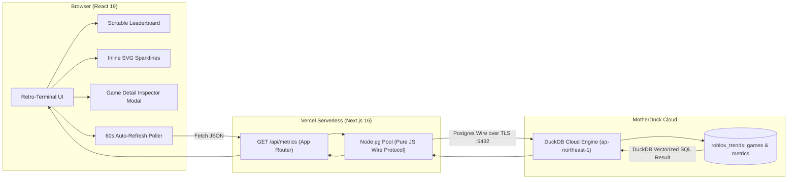

# ⚡ BloxTrends — Real-Time Roblox Trend Tracker (Frontend)

The modern, retro-terminal analytical web interface for the Roblox Trend Tracker. Built with **Next.js 16 (App Router)**, **React 19**, and **Tailwind CSS v4**, deployed serverless on **Vercel**.

BloxTrends visualizes real-time platform telemetry, player momentum velocity, ML-clustered sub-genres, and historical CCU trajectories directly from **MotherDuck**.

---

## 📑 Table of Contents

- [Core Architecture](#-core-architecture)
- [Key Features](#-key-features)
- [Directory Structure](#-directory-structure)
- [API Documentation (`/api/metrics`)](#-api-documentation-apimetrics)
- [Getting Started & Local Development](#-getting-started--local-development)
- [Environment Configuration](#-environment-configuration)
- [Vercel Deployment Guide](#-vercel-deployment-guide)

---

## 🏛 Core Architecture



### MotherDuck Postgres Wire Protocol
Rather than bundling native C++ DuckDB shared libraries (`libduckdb.so`) which fail inside serverless Linux containers, `/api/metrics` utilizes MotherDuck's **PostgreSQL Wire Protocol Gateway** via pure-Node `pg`. This allows the serverless function to execute full DuckDB SQL queries (CTEs, window functions, and `LIST()` aggregations) over TLS without binary dependencies.

---

## ✨ Key Features

- **Real-Time Leaderboard**: Ranks experiences by live CCU with peak player counts, total visits, and community approval percentages.
- **Trend Velocity & "Rising Stars" Mode**: Calculates momentum deltas ($\pm\%$ CCU change and raw player gains between snapshots). One-click toggle isolates rapidly surging games.
- **Interactive Search & Filtering**: Instant fuzzy search across game titles, descriptions, and universe IDs.
- **Genre Market Share Visualizer**: Interactive distribution bar displaying player share across machine-learning sub-genres with quick-filter pills.
- **Inline SVG Sparklines**: Ultra-lightweight vector sparklines in every row plotting the last 10 ingestion snapshots.
- **Deep Inspector Modal**: Detailed experience drill-down featuring:
  - Scaled historical CCU curve chart
  - Community upvote/downvote ratio bar
  - Publication and last update dates
  - Clean formatted description and direct Roblox launch button
- **Retro-Modern Terminal Aesthetic**: Playful terminal motif complete with pixel badges, CRT scanline styling, and seamless Light/Dark mode toggling.
- **Auto-Refresh Telemetry**: Background polling every 60 seconds with an animated live-sync indicator.
- **Density & Sort Controls**: Switch display limits (10 / 25 / 50 / ALL) and sort by Rank, CCU, Velocity, Visits, or Approval.

---

## 📂 Directory Structure

```text
frontend/
├── app/
│   ├── api/
│   │   └── metrics/
│   │       └── route.ts         # Serverless MotherDuck Postgres gateway endpoint
│   ├── favicon.ico              # Terminal pixel favicon
│   ├── globals.css              # Global styles, fonts, and scanline effects
│   ├── layout.tsx               # Root layout & HTML shell
│   └── page.tsx                 # Main dashboard UI, table, modals, sparklines
├── public/                      # Static assets
├── next.config.ts               # Next.js configuration
├── package.json                 # Project dependencies & scripts
├── postcss.config.mjs           # Tailwind CSS v4 PostCSS config
├── tsconfig.json                # TypeScript strict configuration
└── README.md                    # Frontend documentation
```

---

## 📡 API Documentation (`/api/metrics`)

### Endpoint
`GET /api/metrics`

### Query Parameters
| Parameter | Type | Default | Description |
| :--- | :--- | :--- | :--- |
| `limit` | `number` | `100` | Maximum number of top trending games to return (capped between 1 and 200). |

### Response Schema (`GameMetric[]`)
```typescript
interface GameMetric {
  universe_id: string;              // Unique Roblox Universe ID
  name: string;                     // Experience title
  description: string;              // Developer description
  created_at: string;               // ISO 8601 creation timestamp
  genre: string;                    // ML-assigned sub-genre cluster label
  ccu: number;                      // Current concurrent active players
  prev_ccu: number | null;          // CCU in the previous telemetry snapshot
  ccu_diff: number | null;          // Absolute change in CCU (ccu - prev_ccu)
  ccu_pct_change: number | null;    // Percentage velocity change (+/- %)
  visits: string;                   // Cumulative visits (64-bit integer string)
  upvotes: number;                  // Positive vote count
  downvotes: number;                // Negative vote count
  timestamp: string;                // ISO 8601 snapshot timestamp
  peak_ccu: number | null;          // Peak CCU recorded across recent history
  ccu_history: number[];            // Historical CCU series for sparklines (up to 10 points)
}
```

---

## 🚀 Getting Started & Local Development

### 1. Prerequisites
- **Node.js**: `v18.17+` (v20+ or v22 LTS recommended)
- **npm** or **pnpm** / **yarn** / **bun**

### 2. Installation
Navigate to the `frontend/` directory and install dependencies:

```bash
cd frontend
npm install
```

### 3. Environment Setup
Create a `.env.local` file inside `frontend/`:

```ini
MOTHERDUCK_TOKEN=eyJhbGciOi...
# Optional: defaults to pg.ap-northeast-1-aws.motherduck.com
MOTHERDUCK_HOST=pg.ap-northeast-1-aws.motherduck.com
```

### 4. Run Development Server
```bash
npm run dev
```

Open [http://localhost:3000](http://localhost:3000) in your browser.

### 5. Build for Production
To verify the production build locally:

```bash
npm run build
npm run start
```

---

## 🌐 Vercel Deployment Guide

1. **Connect Repository**: Import the `roblox-trend-tracker` GitHub repository into your [Vercel Dashboard](https://vercel.com).
2. **Set Root Directory**: In the project settings, set the **Root Directory** to `frontend`.
3. **Configure Environment Variables**:
   In **Project Settings > Environment Variables**, add:
   - `MOTHERDUCK_TOKEN`: Your MotherDuck access token (e.g. `eyJhbGciOi...`).
   - *(Optional)* `MOTHERDUCK_HOST`: Set if your database is hosted outside `ap-northeast-1`.
4. **Deploy**: Trigger deployment. Vercel automatically builds with Turbopack and deploys `/api/metrics` as a serverless edge-compatible function.
